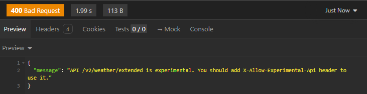
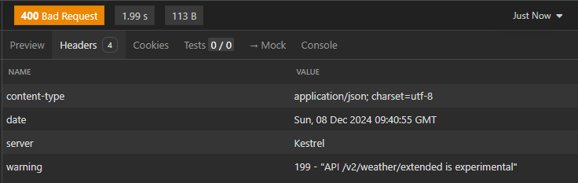
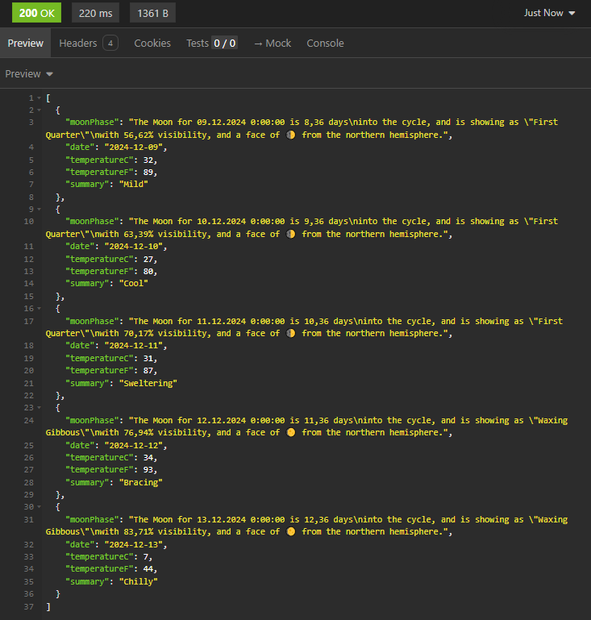
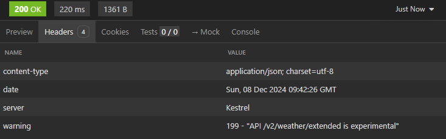
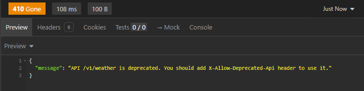
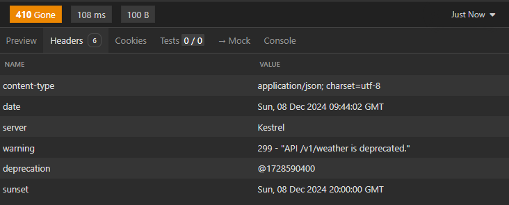
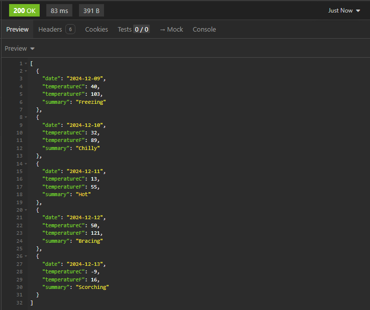
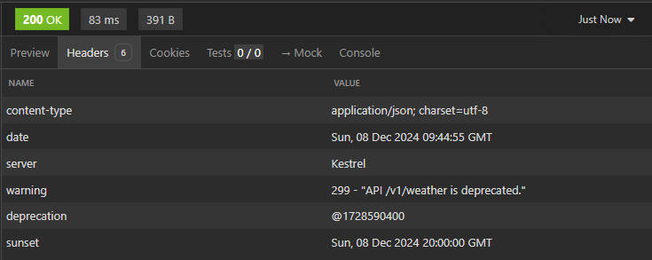

# Управление жизненным циклом веб API

## Стадии жизненного цикла API

При разработке долгоживущих продуктов, представляющих своё API для внешнего использования, неизбежно встают проблемы связанные с необходимостью обеспечения обратной совместимости. Продукт со временем эволюционирует и возникает потребность согласно изменениям в продукте также развивать и его API.
У API как и у продукта есть свой жизненный цикл. Выделяют 5 стадий жизненного цикла API:
* **Планирование (Proposed)** - этап планирования заключается в оповещении о том, что вы создаёте API, и в сборе первоначальных отзывов о дизайне и форме API от потребителей. Это позволяет обсудить API и область его применения, а также учесть все ранние проектные решения.
* **Бета-версия (Experimental)**  - релиз версии API для пользователей, дающий возможность начать интеграцию. Как правило это делается с целью получения обратной связи и улучшению API. На этом этапе производитель оставляет за собой право нарушить совместимость, поскольку это не версионный API.
* **Запуск (Release)** - API версионирован и запущен в производство. Любые изменения с этого момента будут представлять версионные изменения.
* **Устаревание (Deprecated)** - когда API устаревает, он всё ещё доступен для использования, но значительные новые разработки не должны вестись на его основе.
* **Вывод из эксплуатации (Sunset)** - API выведен из эксплуатации и более не доступен.

Управление жизненным циклом API заключается в актуализации стадии этого цикла для каждой версии API.

## Управление жизненным циклом на уровне кода

В том случае, когда API в продукте представлено кодом, разумно будет перенести управление жизненным циклом на уровень кода.
Для стадии **Планирование** ничего особенного делать не нужно, API в виде когда на этом этапе ещё не существует.
API в стадии **бета-версии** в коде на C# можно пометить специальным атрибутом Experimental[1].
**Действующую версию** API никак дополнительно помечать не нужно.
Для пометки **устаревшего** кода используется атрибут Obsolete[2].
API, **выведенное из эксплуатации**, можно удалить в коде.

## Особенность взаимодействия с устаревшим и экспериментальным веб API

Теперь, когда наше веб API аннотировано в соответствии со стадиями жизненного цикла, необходимо решить, как это будет отражаться на его работе.

### Экспериментальное API

Какие требования мы предъявляем к работе с экспериментальным API?
Очевидно мы не гарантируем его неизменность, поэтому потребитель нашего API должен явно отдавать себе отчёт в том, что на нашем API можно построить только экспериментальный продукт.
Что должно случиться, если потребитель просто вызовет экспериментальное API?
Мы не можем просто успешно выполнить запрос, т.к. в таком случае потребитель останется в полном неведении о том, что работает с бета-версией API.
Мы должны вернуть ошибку BadRequest (400) и в тексте ошибки сообщить, что вызываемое API экспериментальное.
Как же тогда работать с нашим API?
Подсказка в ответе на запрос должна указать потребителю, что для вызова API он должен добавить в запрос специальный заголовок X-Allow-Experimental-Api, в значении которого указать путь к экспериментальному API, для которого разрешается вызов.
Пример, пусть по пути /v2/accounts у нас размещено наше экспериментальное API, тогда для выполнения запроса к нему потребитель должен добавить заголовок:
```
X-Allow-Experimental-Api: /v2/accounts
```

Если требуется работать с несколькими экспериментальными API, то все их пути должны быть добавлены в заголовок:
```
X-Allow-Experimental-Api: /v2/accounts /v2/persons
```

Или вариант для ленивых:
```
X-Allow-Experimental-Api: *
```

Теперь запрос должен успешно выполниться, но в хорошим тоном будет добавить к ответу специальный заголовок Warning:
```
Warning: 199 - ""API {path} is experimental"
```

Так мы сможем на уровне инфраструктуры отслеживать работу с экспериментальными API.

### Устаревшее API

Работа с устаревшим API должна быть выстроена похожим образом. Мы блокируем вызов к этому API до тех пор, пока не будет указан специальный заголовок X-Allow-Deprecated-Api, в значении которого задан путь к вызываемому API или символ "*".

Если потребитель  обращается к устаревшему API без специального заголовка в запросе, то сервер должен вернуть ответ Gone(410), что сообщит потребителю о том, что запрос в целом верен, но данный путь уже отсутствует. В тексте ответа необходимо пояснить, что API по запрошенному пути устарел и для вызова необходимо добавить специальный заголовок.
Дополнительно необходимо вернуть ещё 2 заголовка:
```
Deprecation: @1728590400
Sunset: Wed, 04 Dec 2024 20:00:00 GMT
```

Заголовок Deprecation указывает дату, когда API было признано устаревшим. Заголовок Sunset указывает на дату, когда API будет выведено из эксплуатации.

Для успешного вызова устаревшего API необходимо добавить заголовок X-Allow-Deprecated-Api, в значении которого указать путь к вызываемому API:
```
X-Allow-Deprecated-Api: /v1/users
```

В обоих случаях также необходимо к ответу добавить заголовок Warning:
```
Warning: 299 - "API {path} is deprecated"
```

## Реализация для ASP.NET Core WebApi

Выше я указывал на наличие необходимых для аннотирования атрибутов Experimental и Obsolete. Однако, указанные классы атрибутов помечены как sealed и не допускают расширения. Поэтому добавим 2 новых атрибута:
* ExperimentalApi - для обозначения экспериментального API
* DeprecatedApi - для обозначения устаревшего API

Для того, чтобы получить необходимое поведение, реализуем атрибуты в виде фильтров ресурсов из ASP.NET Core.

Атрибут для экспериментального API:

```csharp
/// <summary>
/// Фильтр для обработки запросов к экспериментальному API.
/// </summary>
[AttributeUsage(AttributeTargets.Class | AttributeTargets.Method)]
public class ExperimentalApi : Attribute, IResourceFilter
{
  #region IResourceFilter

  /// <summary>
  /// <see cref="IResourceFilter.OnResourceExecuted(ResourceExecutedContext)"/>
  /// </summary>
  /// <param name="context"></param>
  public void OnResourceExecuted(ResourceExecutedContext context)
  {
  }

  /// <summary>
  /// <see cref="IResourceFilter.OnResourceExecuting(ResourceExecutingContext)"/>
  /// </summary>
  /// <param name="context"></param>
  public void OnResourceExecuting(ResourceExecutingContext context)
  {
    bool allowRequestExecute = IsRequestAllowed(context.HttpContext.Request);

    context.HttpContext.Response.Headers.Warning = $"199 - \"API {context.HttpContext.Request.Path} is experimental\"";
    
    if (!allowRequestExecute)
    {
      context.Result = new BadRequestObjectResult(new
      {
        Message = $"API {context.HttpContext.Request.Path} is experimental. You should add X-Allow-Experimental-Api header to use it.",
      });
    }
  }

  #endregion

  /// <summary>
  /// Возвращает признак доступности запроса к выполнению.
  /// </summary>
  /// <param name="request">HTTP запрос.</param>
  /// <returns>true - запрос можно выполнить, иначе false.</returns>
  protected static bool IsRequestAllowed(HttpRequest request)
  {
    string? allowedExperimentalApis = request.Headers["X-Allow-Experimental-Api"];
    if (!String.IsNullOrEmpty(allowedExperimentalApis))
    {
      if (allowedExperimentalApis == "*")
        return true;

      if (allowedExperimentalApis.Split(' ').Contains(request.Path.Value, StringComparer.OrdinalIgnoreCase))
        return true;
    }

    return false;
  }
}
```

Атрибут для устаревшего API:
```csharp
/// <summary>
/// Фильтр для обработки запросов к устаревшему API.
/// </summary>
[AttributeUsage(AttributeTargets.Class | AttributeTargets.Method)]
public class DeprecatedApi : Attribute, IResourceFilter
{
  /// <summary>
  /// Дата в формате ISO 8601, с которой API считается устаревшим.
  /// </summary>
  public string? From { get; set; }

  /// <summary>
  /// Дата в формате ISO 8601, с которой API будет недоступен.
  /// </summary>
  public string? Sunset { get; set; }

  #region IResourceFilter

  /// <summary>
  /// <see cref="IResourceFilter.OnResourceExecuted(ResourceExecutedContext)"/>
  /// </summary>
  /// <param name="context"></param>
  public void OnResourceExecuted(ResourceExecutedContext context)
  {
  }

  /// <summary>
  /// <see cref="IResourceFilter.OnResourceExecuting(ResourceExecutingContext)"/>
  /// </summary>
  /// <param name="context"></param>
  public void OnResourceExecuting(ResourceExecutingContext context)
  {
    bool allowRequestExecute = IsRequestAllowed(context.HttpContext.Request);

    context.HttpContext.Response.Headers.Warning = $"299 - \"API {context.HttpContext.Request.Path} is deprecated.\"";

    if (DateTimeOffset.TryParse(From, out DateTimeOffset fromDate))
      context.HttpContext.Response.Headers["Deprecation"] = $"@{fromDate.ToUnixTimeSeconds()}";

    if (DateTimeOffset.TryParse(Sunset, out DateTimeOffset sunsetDate))
    {
      context.HttpContext.Response.Headers["Sunset"] = $"{sunsetDate.ToUniversalTime():r}";
      if (DateTimeOffset.Now > sunsetDate)
        allowRequestExecute = false;
    }

    if (!allowRequestExecute)
    {        
      context.Result = new JsonResult(new
      {
        Message = $"API {context.HttpContext.Request.Path} is deprecated. You should add X-Allow-Deprecated-Api header to use it.",
      });
      context.HttpContext.Response.StatusCode = 410;
    }
  }

  #endregion

  /// <summary>
  /// Возвращает признак доступности запроса к выполнению.
  /// </summary>
  /// <param name="request">HTTP запрос.</param>
  /// <returns>true - запрос можно выполнить, иначе false.</returns>
  protected static bool IsRequestAllowed(HttpRequest request)
  {
    string? allowedDeprecateApis = request.Headers["X-Allow-Deprecated-Api"];
    if (!String.IsNullOrEmpty(allowedDeprecateApis))
    {
      if (allowedDeprecateApis == "*")
        return true;

      if (allowedDeprecateApis.Split(' ').Contains(request.Path.Value, StringComparer.OrdinalIgnoreCase))
        return true;
    }

    return false;
  }
}
```

## Как это работает

Пример проекта с API размещён в репозитории [Kychanov-sa/WebApiLifeCycle](https://github.com/Kychanov-sa/WebApiLifeCycle).
В примере два контроллера API.
Контроллер **DeprecatedWeatherForecastController** представляет устаревшее API и помечен атрибутом DeprecatedApi:
```csharp
 [DeprecatedApi(From = "2024-10-11", Sunset = "2024-12-05")]
 [Obsolete]
 [ApiController]
 [Route("v1/weather")]
 public class DeprecatedWeatherForecastController : ControllerBase
 {
 ...
 }
```

Контроллер **ActualWeatherForecastController** представляет актуальную версию API, однако содержит экспериментальный метод GetExtended, который помечен атрибутом ExperimentalApi:
```csharp
[ExperimentalApi]
[Experimental(diagnosticId:"E1233")]
[HttpGet("extended")]
public IEnumerable<WeatherForecastEx> GetExtended()
{
 ...
}
```

Попробуем вызвать наше экспериментальное API без указания заголовка X-Allow-Experimental-Api:




Добавим заголовок
```
X-Allow-Experimental-Api: *
```
и повторим запрос.



Повторим проверку для устаревшего API, сначала без заголовка X-Allow-Deprecated-Api:



Установим заголовок:
```
X-Allow-Deprecated-Api: /v1/weather
```
повторим запрос:



Если мы установим дату Sunset в атрибуте DeprecatedApi как прошедшую, то при выполнении запроса всегда будет возвращаться результат 410, т.к. API считается выведенным из эксплуатации.
## Полезные ссылки
* [[1]] [Experimental attribute - C# feature specifications | Microsoft Learn](https://learn.microsoft.com/en-us/dotnet/csharp/language-reference/proposals/csharp-12.0/experimental-attribute)
* [[2]] [ObsoleteAttribute Класс (System) | Microsoft Learn](https://learn.microsoft.com/ru-ru/dotnet/api/system.obsoleteattribute?view=net-8.0)
* [[3]] [Calculate the Moon Phase With C# | Khalid Abuhakmeh](https://khalidabuhakmeh.com/calculate-moon-phase-with-csharp)